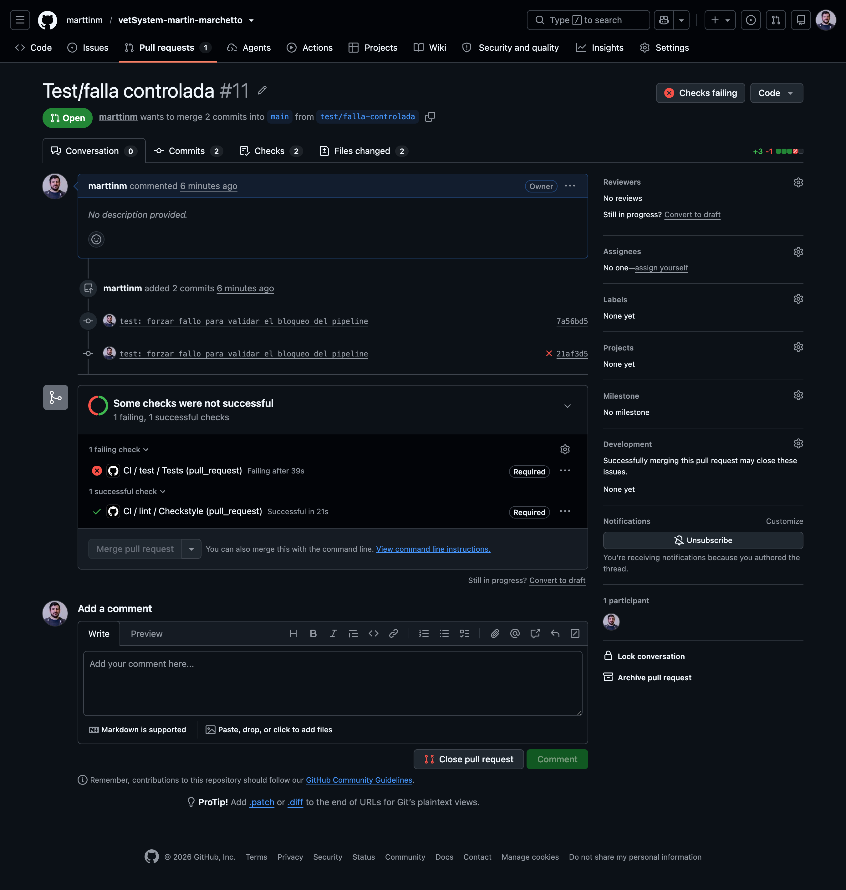

# Evidencias del TP de DevOps

Registro de capturas, salidas de comandos y decisiones para armar el informe final.
Las capturas se guardan en `docs/devops/img/`.

## Fase 2 — Gestión de cambios y versionado

### Estrategia de branching
Se adoptó Trunk-Based Development: `main` es la única rama permanente y cada cambio se trabaja en una rama corta que se integra mediante Pull Request.
La rama `materia-devops`, usada al inicio, se integró a `main` por PR y desde entonces se trabaja con ramas como `ci/github-actions`.

- [ ] Captura del PR de Docker mergeado

### Protección de la rama `main`
Se configuró una regla de protección sobre `main` que exige Pull Request para integrar cambios y que los checks de CI (`lint / Checkstyle` y `test / Tests`) pasen antes del merge. No se permite saltear la regla, ni siquiera al administrador.

**Problema encontrado**: la regla figuraba como "Not enforced". En el plan gratuito de GitHub las reglas de protección solo se aplican en repositorios públicos, y el repositorio era privado. El PR del pipeline de CI se integró antes de detectarlo. Se cambió la visibilidad del repositorio a público (requisito del TP), tras verificar que el historial no contuviera credenciales.

- [ ] Captura de la regla como "Not enforced" con el repositorio privado
- [ ] Captura de la regla aplicada, con los checks obligatorios

### Verificación del historial antes de hacer público el repositorio
Se buscaron credenciales en todo el historial:

```bash
git --no-pager log -p --all | grep -iE "password|secret|token" | grep -v "DB_PASSWORD"
```

Resultado: solo aparecen variables del wrapper de Maven (`MVNW_PASSWORD`), la contraseña del PostgreSQL efímero del pipeline (`ci`) y la contraseña por defecto (`root`) de la base local usada antes de la migración desde MySQL. Ninguna es una credencial real. El archivo `.env` nunca se versionó.

### Conventional Commits
El historial sigue la convención a partir del commit `83789ee`. Los dos commits iniciales (`b58134b` y `d80ccf3`) son previos a su adopción y no se reescribieron para no alterar el historial ya publicado.

## Fase 3 — Docker

### Dockerfile
- Multi-stage: etapa de build con `maven:3.9.9-eclipse-temurin-21-alpine` y etapa final solo con `eclipse-temurin:21-jre-alpine`.
- Sin tag `latest`, versiones fijadas.
- Se copia primero el `pom.xml` y se ejecuta `mvn dependency:go-offline` antes de copiar `src`, para cachear las dependencias.
- La app corre con el usuario sin privilegios `spring`.

- [ ] Salida de `docker compose exec app whoami` (debe responder `spring`)
- [ ] Salida de `docker images` con el tamaño de la imagen final
- [ ] Rebuild tras modificar código, mostrando `mvn dependency:go-offline` como `CACHED`

### docker-compose
Levanta la API y PostgreSQL con `docker compose up --build`. La base tiene healthcheck y la app espera a que esté `healthy` antes de arrancar. Los datos persisten en un volumen.

- [ ] Captura de `docker compose ps` con ambos servicios corriendo

### Problemas encontrados
- **Contexto de build vacío (`transferring context: 2B`)**: el Dockerfile estaba en la raíz del repo, pero el proyecto Maven está en `vet-system/`. Se movieron el Dockerfile y el `.dockerignore` a esa carpeta y se configuró `context: ./vet-system` en el compose.
- **Postgres no arrancaba**: la imagen oficial exige `POSTGRES_PASSWORD` no vacío. El `.env` tenía `DB_PASSWORD=` vacío. Se definió una contraseña; la configuración local sin Docker no se ve afectada porque Spring no lee el `.env`.

## Fase 4 — CI/CD

### Linter: Checkstyle (2026-10-04)
Se agregó Checkstyle con una configuración propia (`vet-system/checkstyle.xml`) enfocada en problemas reales, en lugar de las configuraciones de Google o Sun, que reportan cientos de violaciones de formato.

Primera ejecución de `./mvnw checkstyle:check`: 19 errores y `BUILD FAILURE`.

```
[INFO] There are 19 errors reported by Checkstyle 10.20.1 with checkstyle.xml ruleset.
[ERROR] src/main/java/com/vetSystem/Dto/DuenioDTO.java:[4,38] (imports) AvoidStarImport
[ERROR] src/main/java/com/vetSystem/Dto/TurnoRequestDTO.java:[4,38] (imports) AvoidStarImport
[ERROR] src/main/java/com/vetSystem/Dto/VeterinarioDTO.java:[4,38] (imports) AvoidStarImport
[ERROR] src/main/java/com/vetSystem/Dto/MascotaDTO.java:[3,38] (imports) AvoidStarImport
[ERROR] src/main/java/com/vetSystem/Dto/MedicamentoRequestDTO.java:[4,38] (imports) AvoidStarImport
[ERROR] src/main/java/com/vetSystem/Entity/Mascota.java:[3,27] (imports) AvoidStarImport
[ERROR] src/main/java/com/vetSystem/Entity/Turno.java:[3,27] (imports) AvoidStarImport
[ERROR] src/main/java/com/vetSystem/Entity/Veterinario.java:[3,27] (imports) AvoidStarImport
[ERROR] src/main/java/com/vetSystem/Entity/Duenio.java:[3,27] (imports) AvoidStarImport
[ERROR] src/main/java/com/vetSystem/Entity/Duenio.java:[4,14] (imports) AvoidStarImport
[ERROR] src/main/java/com/vetSystem/Entity/Medicamento.java:[3,27] (imports) AvoidStarImport
[ERROR] src/main/java/com/vetSystem/Controller/VeterinarioController.java:[10,47] (imports) AvoidStarImport
[ERROR] src/main/java/com/vetSystem/Controller/DuenioController.java:[19,47] (imports) AvoidStarImport
[ERROR] src/main/java/com/vetSystem/Controller/TurnoController.java:[21,47] (imports) AvoidStarImport
[ERROR] src/main/java/com/vetSystem/Controller/MascotaController.java:[5,8] (imports) UnusedImports: Unused import - com.vetSystem.Entity.Mascota.
[ERROR] src/main/java/com/vetSystem/Controller/MascotaController.java:[11,47] (imports) AvoidStarImport
[ERROR] src/main/java/com/vetSystem/Controller/MedicamentoController.java:[11,47] (imports) AvoidStarImport
[ERROR] src/main/java/com/vetSystem/VetSystemApplication.java:[9,1] (whitespace) FileTabCharacter
[ERROR] src/test/java/com/vetSystem/VetSystemApplicationTests.java:[9,1] (whitespace) FileTabCharacter
[INFO] BUILD FAILURE
[ERROR] Failed to execute goal org.apache.maven.plugins:maven-checkstyle-plugin:3.6.0:check (default-cli) on project vet-system: You have 19 Checkstyle violations.
```

Resolución:
- Se corrigieron los tabs (2 archivos) y el import sin uso en `MascotaController`.
- Se quitó la regla `AvoidStarImport`: los imports con `*` son una preferencia de estilo, no generan bugs y son la convención del proyecto. Mantenerla agregaba ruido sin valor.

- [ ] Captura de `./mvnw checkstyle:check` en verde tras las correcciones

### Workflow de CI
Se ejecuta en cada Pull Request hacia `main`. Está organizado en workflows reutilizables (`on: workflow_call`):
- `lint.yml`: Checkstyle.
- `test.yml`: tests con un service container de PostgreSQL 14.
- `ci.yml`: orquestador que se dispara en el PR y llama a ambos.

Lint y tests corren en paralelo para dar feedback más rápido; como los dos son obligatorios, si cualquiera falla el PR se bloquea igual. El workflow usa permisos de solo lectura y cancela ejecuciones anteriores del mismo PR (`concurrency`).

- [ ] Captura de los checks del PR #N en verde
- [ ] Captura del historial de ejecuciones en la pestaña Actions
- [x] Captura del PR bloqueado cuando falla un check

### Publicación en Docker Hub
- [ ] Captura de la imagen publicada con su tag SemVer

## Fase 5 — Observabilidad

## Andon Cord (dónde se corta el pipeline)
- **Linter**: si Checkstyle encuentra violaciones, el job `lint / Checkstyle` falla.
- **Tests**: si algún test falla, el job `test / Tests` falla.
- **Regla de protección de `main`**: ambos checks son obligatorios y la regla no admite excepciones, por lo que con cualquiera de los dos en rojo el botón de merge queda deshabilitado y el cambio no llega a `main`.

## Experimento de falla controlada

### Test unitario roto a propósito ([PR #11](https://github.com/marttinm/vetSystem-martin-marchetto/pull/11))
**Qué se rompió**: en `DuenioServiceTest.getAllDuenios_cuandoHayDuenios_retornaLista` se cambió el valor esperado del nombre del dueño de `"Carlos"` a `"Carlos1"`, simulando un cambio que introduce un error de lógica.

**Cómo reaccionó el sistema**:
- El workflow de CI se ejecutó automáticamente al abrir el PR.
- El job `lint / Checkstyle` pasó, ya que el código cumple las reglas de estilo.
- El job `test / Tests` falló: la aserción esperaba `"Carlos1"` y el servicio devolvió `"Carlos"`. El log del job indica el test fallido y la diferencia entre ambos valores.
- GitHub marcó el PR en rojo y la regla de protección de `main` deshabilitó el merge.

**Resultado**: el cambio defectuoso no llegó a `main`. El PR se cerró sin integrar.

**Conclusión**: el Andon Cord funciona como se diseñó: un error detectado por los tests detiene el flujo antes de la integración, sin depender de una revisión manual.



## Desperdicios Lean

## Decisiones tomadas
- **Versionado SemVer**: lo exige la Fase 4 para etiquetar la imagen en Docker Hub. Además es coherente con Conventional Commits (`feat` sube el MINOR, `fix` el PATCH).
- **Trunk-Based Development**: una sola rama permanente y ramas cortas por cambio. Es el modelo más simple para un proyecto individual y favorece entregas en lotes pequeños.
- **Repositorio público sin aprobaciones obligatorias**: solo el dueño tiene permisos de escritura, por lo que nadie más puede pushear ni mergear; terceros solo pueden proponer cambios desde un fork. No se exige aprobación de reviews porque GitHub no permite aprobar PRs propios y, siendo un único desarrollador, bloquearía todos los merges. El control de calidad lo garantizan los checks obligatorios.
- **Configuración por variables de entorno**: `DB_URL`, `DB_USERNAME` y `DB_PASSWORD` con valores por defecto locales. El mismo código funciona sin cambios en local, en Docker y en CI.
- **Paridad de versiones**: Java 21 y PostgreSQL 14 en local, en el contenedor y en el pipeline, para que los entornos sean equivalentes.
- **Postgres en el pipeline**: `VetSystemApplicationTests` levanta el contexto completo de Spring y necesita una base de datos. En CI se usa un service container de PostgreSQL en lugar de eliminar el test.
- **Reglas de Checkstyle propias**: se eligieron reglas que detectan problemas reales en lugar de adoptar una configuración externa completa.
- **Workflows reutilizables**: lint y tests se definen una sola vez y se invocan desde el workflow de CI; el workflow de release va a reutilizar los mismos tests sin duplicar configuración.